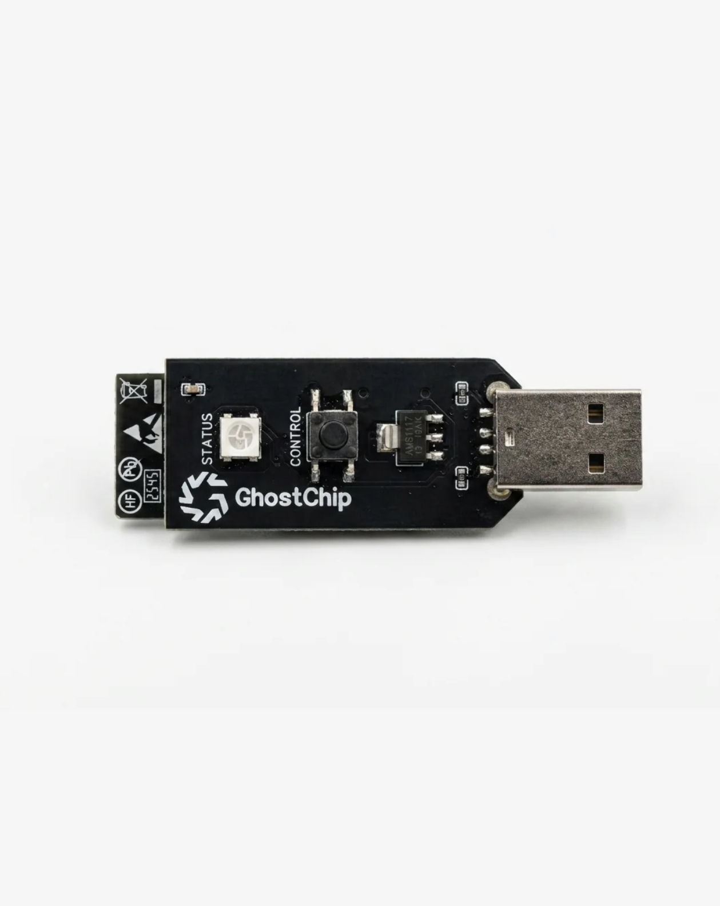
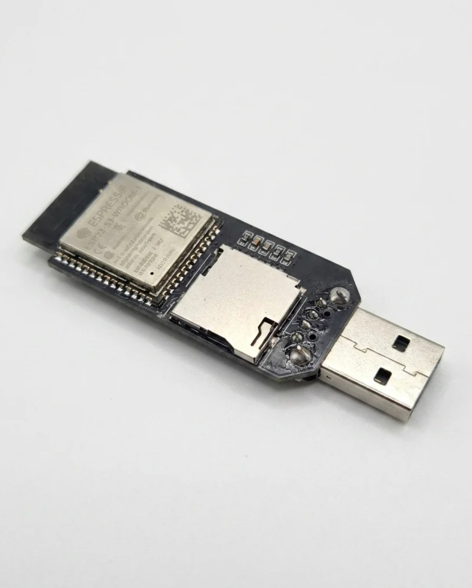

# ⚡ GhostChip — ESP32-S3 Security & Development Learning Toolkit

<p align="center">
  
</p>

<p align="center">
  <b>ESP32-S3-WROOM-1 • USB-A • Wi-Fi 2.4 GHz • Bluetooth 5.0 • microSD • NeoPixel</b>
</p>

<p align="center">
  <a href="https://gamkers.github.io/GhostChipUI/">🌐 OPEN THE GHOSTCHIP WEB UI</a>
</p>
https://ghostesp.net/companion

---

## 📖 Table of Contents

- [What is GhostChip?](#-what-is-ghostchip)
- [Product Specifications](#-product-specifications)
- [Hardware Explained](#-hardware-explained)
- [Hardware Map](#-hardware-map)
- [How the Board Works](#-how-the-board-works)
- [Power System](#-power-system)
- [ESP32-S3 Explained](#-esp32-s3-explained)
- [USB Interface](#-usb-interface)
- [Wi-Fi and Bluetooth](#-wi-fi-and-bluetooth)
- [microSD Storage](#-microsd-storage)
- [NeoPixel](#-neopixel)
- [User/Boot Button](#-userboot-button)
- [AI and Groq Architecture](#-ai-and-groq-architecture)
- [GhostChip Web UI](#-ghostchip-web-ui)
- [DuckyScript Learning](#-duckyscript-learning)
- [Network Security Learning](#-network-security-learning)
- [Firmware Development](#-firmware-development)
- [Arduino IDE](#-arduino-ide)
- [ESP-IDF](#-esp-idf)
- [Building Your Own Version](#-building-your-own-version)
- [Parts and BOM](#-parts-and-bom)
- [Software Architecture](#-software-architecture)
- [GitHub Project Structure](#-github-project-structure)
- [Learning Roadmap](#-learning-roadmap)
- [Safe Cybersecurity Lab](#-safe-cybersecurity-lab)
- [Troubleshooting](#-troubleshooting)
- [Safety and Legal Notice](#-safety-and-legal-notice)
- [References](#-references)

---

# 👻 What is GhostChip?

GhostChip is an ESP32-S3-based hardware platform designed around embedded development, wireless experimentation, USB development, removable storage, RGB status indication and security-learning workflows.

The supplied product information identifies the main module as **ESP32-S3-WROOM-1** and lists:

- USB-A male plug-and-play interface
- Dual-core Xtensa LX7 processor at up to 240 MHz
- Wi-Fi 2.4 GHz
- Bluetooth 5.0
- microSD card reader using SPI
- One addressable RGB NeoPixel
- One GPIO user/boot button
- AMS1117 5 V → 3.3 V regulator
- Android APK + Web PWA support
- Llama 3.3 70B access through the Groq API

The board should be treated as a **development and authorized security-learning platform**, not as a device for unauthorized access.

---

# 📋 Product Specifications


| Feature | Specification |
|---|---|
| **Module** | ESP32-S3-WROOM-1 |
| **Interface** | USB-A (Male) — Plug & Play |
| **Processor** | Dual-core Xtensa LX7 @ 240 MHz |
| **AI Engine** | Llama 3.3 70B via Groq API |
| **Storage** | microSD Card Reader (SPI) |
| **LED** | 1× Addressable RGB NeoPixel |
| **Button** | 1× GPIO User / Boot Button |
| **Wireless** | Wi-Fi 2.4 GHz + Bluetooth 5.0 |
| **Regulator** | AMS1117 (5 V → 3.3 V LDO) |
| **App Support** | Android APK + Web PWA (iOS/Desktop) |

### Important AI clarification

The phrase **“Llama 3.3 70B via Groq API”** does not mean that a 70-billion-parameter model is stored and executed locally on the ESP32-S3.

A typical architecture is:

```text
GhostChip
   │
   │ Wi-Fi
   ▼
Application / Backend
   │
   ▼
Groq API
   │
   ▼
Llama Model
```

The ESP32-S3 performs device-side tasks while the remote AI service performs model inference.

---

# 🧩 Hardware Explained





## 1. ESP32-S3-WROOM-1

The ESP32-S3-WROOM-1 is the main computing module.

It provides:

- CPU processing
- GPIO
- Wi-Fi
- Bluetooth LE
- USB capabilities
- Timers
- SPI
- I²C
- UART
- PWM
- ADC and other peripherals

The exact Flash/PSRAM configuration depends on the specific WROOM variant used on the board.

---

## 2. USB-A Male Connector

The board uses a male USB-A connector instead of the more common USB-C connector.

It can provide:

- USB communication
- Firmware flashing, depending on the board design
- Serial/debug communication, depending on firmware/design
- Power input

The exact USB implementation must be verified against the GhostChip schematic.

---

## 3. AMS1117 Regulator

The product specification lists:

```text
USB / 5 V input
      │
      ▼
   AMS1117
      │
      ▼
   ~3.3 V
      │
      ▼
 ESP32-S3
```

The regulator provides the lower-voltage rail required by the ESP32-S3 system.

> Do not assume that every external connector or GPIO is 5 V tolerant.

---

## 4. microSD Card Reader

The board includes a microSD reader using **SPI**.

Possible uses:

- Configuration files
- Logs
- Sensor data
- Scripts
- Firmware assets
- Device settings
- Local project files

Example:

```text
GhostChip
   │
   ▼
SPI
   │
   ▼
microSD
   │
   ├── config.json
   ├── logs.csv
   ├── scripts/
   └── data/
```

---

## 5. NeoPixel

The board has one addressable RGB NeoPixel.

It can be used for:

```text
GREEN  → Ready
BLUE   → Wi-Fi connected
PURPLE → BLE active
YELLOW → SD activity
RED    → Error
WHITE  → Firmware operation
```

These colors are examples; the actual firmware behavior can be customized.

---

## 6. User / Boot Button

The board contains one GPIO user/boot button.

Possible firmware uses:

```text
Short press  → change mode
Double press → change LED status
Long press   → reset / special mode
Boot press   → enter bootloader, if wired/configured for it
```

The exact GPIO number and behavior must be verified from the real PCB design.

---

# 🗺️ Hardware Map

```text
                         USB-A MALE
                             │
                             ▼
                    ┌────────────────┐
                    │   5 V INPUT    │
                    └───────┬────────┘
                            ▼
                    ┌────────────────┐
                    │    AMS1117     │
                    │    5V → 3.3V  │
                    └───────┬────────┘
                            │
                            ▼
                 ┌──────────────────────┐
                 │   ESP32-S3-WROOM-1   │
                 │       MAIN MCU       │
                 └───┬────┬────┬────┬──┘
                     │    │    │    │
                    WiFi BLE  USB  GPIO
                     │    │    │    │
                     │    │    │    └── User Button
                     │    │    │
                     │    │    └────── Computer
                     │    │
                     │    └────────── BLE devices
                     │
                     └─────────────── Wi-Fi

                 ┌──────────────┐
                 │  microSD SPI │
                 └──────────────┘

                 ┌──────────────┐
                 │ NeoPixel RGB │
                 └──────────────┘
```

### ⚠️ GPIO mapping warning

This README intentionally does **not** invent GPIO numbers.

For a custom PCB, GPIO assignments should be obtained from:

1. The official schematic
2. PCB design files
3. Board documentation
4. Verified PCB trace measurements

Only after verification should a pin map be added.

---

# ⚙️ How the Board Works

At a high level:

```text
             USB
              │
              ▼
          Power Rail
              │
              ▼
          ESP32-S3
        ┌─────┼─────┐
        │     │     │
        ▼     ▼     ▼
      Wi-Fi  BLE   USB
        │
        ▼
    Web / API
        │
        ▼
   Optional AI
```

Local hardware:

```text
ESP32-S3
 ├── GPIO
 ├── NeoPixel
 ├── Button
 ├── SPI → microSD
 ├── Wi-Fi
 ├── BLE
 └── USB
```

---

# ⚡ Power System

The listed power path is:

```text
5 V
 │
 ▼
AMS1117
 │
 ▼
3.3 V
 │
 ├── ESP32-S3
 ├── Logic
 └── Other 3.3 V circuitry
```

### Safety rules

- Never intentionally short 5 V to 3.3 V.
- Do not connect 5 V directly to ESP32 GPIO.
- Verify the voltage of external modules.
- Use a common GND when connecting external circuits.
- Check current requirements before adding peripherals.
- Use appropriate protection when designing a new PCB.

---

# 📡 Wi-Fi and Bluetooth

The ESP32-S3 provides:

### Wi-Fi

Useful for:

- Local web interfaces
- API communication
- Device configuration
- IoT experiments
- Telemetry
- Firmware services

### Bluetooth LE

Useful for:

- BLE sensors
- Device configuration
- Wireless control
- BLE application development
- Security-learning labs

A safe learning architecture is:

```text
Phone
  │
 BLE
  │
  ▼
GhostChip
  │
  ▼
Application
```

---

# 💾 microSD Storage

A possible storage structure:

```text
/
├── config/
│   └── device.json
├── logs/
│   └── system.csv
├── scripts/
│   └── training.txt
└── data/
    └── sensor.csv
```

Use the card for non-sensitive development data unless you have implemented appropriate protection.

---

# 🌈 NeoPixel

The NeoPixel can provide a visual device state.

Example state machine:

```text
BOOT
 │
 ▼
GREEN
 │
 ▼
Wi-Fi Connecting
 │
 ├── Success ──► BLUE
 │
 └── Failure ──► RED
                    │
                    ▼
                  Retry
```

---

# 🔘 User / Boot Button

The button can be used as a physical control interface.

Example:

```text
Button
  │
  ├── Short press → next mode
  ├── Double press → status
  └── Long press → reset
```

Do not assume these behaviors are present in the factory firmware.

---

# 🤖 AI and Groq Architecture

The supplied product information lists:

**Llama 3.3 70B via Groq API**

A secure production design should look like:

```text
                  Wi-Fi
GhostChip ─────────────────► Backend
                              │
                              │ secret API key
                              ▼
                          Groq API
                              │
                              ▼
                         AI Model
                              │
                              ▼
                         Response
                              │
                              ▼
                          Backend
                              │
                              ▼
                         GhostChip
```

### 🔐 API key protection

Do not commit private API keys to GitHub.

Avoid:

```text
❌ API key inside public JavaScript
❌ API key inside public README
❌ API key inside public firmware
```

Prefer:

```text
ESP32
  ↓
Your backend
  ↓
Secret environment variable
  ↓
AI API
```

If a key is accidentally published, revoke/rotate it immediately.

---

# 🌐 GhostChip Web UI

## Live UI

### 👉 [Open GhostChip UI](https://gamkers.github.io/GhostChipUI/)

The supplied UI presents itself as an **ESP32-S3 Security Toolkit** and includes a dark, neon-green interface.

The interface includes areas for:

- DuckyScript editor
- Script Builder
- Network Scanner
- Wi-Fi scanning
- BLE scanning
- Passive deauthentication detection
- AI Generator
- NeoPixel control
- Firmware management
- Device information
- User Guide
- Live Keyboard
- File Manager
- Templates
- AI Assistant
- Favourites
- Password Vault
- Shortcut Launcher
- Settings

Use these capabilities only in authorized environments.

---

# 🖥️ UI Architecture

A possible architecture is:

```text
              GhostChip
                  │
             Wi-Fi / USB
                  │
                  ▼
            Web Interface
                  │
        ┌─────────┼─────────┐
        ▼         ▼         ▼
      Device    Scripts    AI/API
       Info       │          │
        │         │          │
        ▼         ▼          ▼
      Status    Storage    Backend
```

The UI can be expanded with:

- Hardware dashboard
- Live device telemetry
- GPIO status
- SD-card browser
- Firmware manager
- Wi-Fi configuration
- BLE configuration
- RGB controls
- Learning tutorials
- Simulator
- Authorized security-lab tools

---

# ⌨️ DuckyScript Learning

The supplied UI includes a DuckyScript editor and script builder.

DuckyScript is a simple scripting syntax used to represent keyboard actions.

Examples of basic educational syntax:

```text
REM Demonstration only
DELAY 500
STRING Hello GhostChip
ENTER
```

Common concepts include:

```text
DELAY
STRING
ENTER
GUI
CTRL
ALT
SHIFT
TAB
ESC
REPEAT
DEFAULTDELAY
REM
```

### Simulator-first workflow

```text
Write script
    ↓
Review
    ↓
Simulator
    ↓
Test on your own device
    ↓
Deploy only when authorized
```

Do not use HID automation to access accounts, steal credentials, install malware, bypass security controls or access computers without permission.

---

# 🔍 Network Security Learning

The platform can be used as a learning environment for:

- Wireless concepts
- BLE concepts
- Network discovery in your own lab
- Packet analysis
- Defensive monitoring
- IoT security
- Device hardening

### Safe lab

```text
                 PRIVATE LAB
                     │
        ┌────────────┼────────────┐
        ▼            ▼            ▼
    GhostChip     Test PC       Test VM
        │            │            │
        └────────────┼────────────┘
                     ▼
              Isolated Network
```

Do not scan or interfere with networks you do not own or have authorization to test.

---

# 🔧 Firmware Development

There are two good development paths.

## Beginner

```text
Arduino IDE
   ↓
ESP32-S3 support
   ↓
Blink
   ↓
Button
   ↓
Serial
   ↓
Wi-Fi
   ↓
BLE
   ↓
microSD
```

## Advanced

```text
ESP-IDF
   ↓
C/C++
   ↓
FreeRTOS
   ↓
Drivers
   ↓
Wi-Fi / BLE
   ↓
USB
   ↓
Storage
   ↓
Custom firmware
```

---

# 🟦 Arduino IDE

Typical workflow:

1. Install Arduino IDE.
2. Install ESP32 board support.
3. Select an ESP32-S3-compatible target.
4. Connect GhostChip through USB.
5. Select the correct port.
6. Upload a basic example.
7. Open Serial Monitor.
8. Begin developing peripherals.

Recommended first programs:

```text
01 Blink
02 Button
03 Serial
04 NeoPixel
05 Wi-Fi
06 Web Server
07 BLE
08 microSD
```

---

# 🟩 ESP-IDF

ESP-IDF is Espressif's official development framework.

Typical workflow:

```text
Install ESP-IDF
      ↓
Create project
      ↓
Select ESP32-S3
      ↓
Configure
      ↓
Build
      ↓
Flash
      ↓
Monitor
```

Example:

```bash
idf.py set-target esp32s3
idf.py menuconfig
idf.py build
idf.py -p PORT flash
idf.py -p PORT monitor
```

Or:

```bash
idf.py -p PORT flash monitor
```

Replace `PORT` with the serial port assigned to your board.

---

# 🧱 Building Your Own GhostChip-Style Board

A custom PCB project should follow:

```text
IDEA
  ↓
REQUIREMENTS
  ↓
BLOCK DIAGRAM
  ↓
PART SELECTION
  ↓
SCHEMATIC
  ↓
POWER DESIGN
  ↓
USB DESIGN
  ↓
ESP32-S3
  ↓
microSD
  ↓
NeoPixel
  ↓
BUTTON
  ↓
PCB LAYOUT
  ↓
ERC / DRC
  ↓
GERBER
  ↓
MANUFACTURING
  ↓
ASSEMBLY
  ↓
FIRMWARE
  ↓
TESTING
```

---

# 🔩 Parts and BOM

Typical component categories:

| Category | Example |
|---|---|
| MCU | ESP32-S3-WROOM-1 |
| Regulator | AMS1117 or suitable 3.3 V regulator |
| USB | USB-A male connector |
| Storage | microSD socket |
| LED | Addressable RGB NeoPixel |
| Input | Push button |
| Passives | Resistors + capacitors |
| Protection | ESD/protection components |
| PCB | Custom PCB |

> This is a learning-level component list, not a manufacturing BOM. Values, footprints and ratings must be taken from the actual schematic and design requirements.

---

# 🧠 Software Architecture

```text
                     MAIN APP
                        │
          ┌─────────────┼─────────────┐
          ▼             ▼             ▼
       Hardware        Wi-Fi          BLE
          │             │             │
          ▼             ▼             ▼
      NeoPixel       Web/API       Services
          │             │             │
          └─────────────┼─────────────┘
                        ▼
                      USB
                        │
                        ▼
                    Computer

                  microSD
                     ▲
                     │
                  Storage
```

---

# 📁 Recommended GitHub Structure

```text
GhostChip/
│
├── README.md
│
├── assets/
│   ├── ghostchip-banner.svg
│   ├── ghostchip-specs.png
│   ├── ghostchip-front.jpeg
│   └── ghostchip-back.jpeg
│
├── firmware/
│   ├── esp32/
│   ├── wifi/
│   ├── ble/
│   ├── usb/
│   └── microsd/
│
├── web-ui/
│   ├── index.html
│   ├── style.css
│   └── app.js
│
├── hardware/
│   ├── schematic/
│   ├── pcb/
│   ├── bom/
│   └── pin-map/
│
├── docs/
│   ├── development.md
│   ├── build.md
│   ├── hardware.md
│   └── cybersecurity-lab.md
│
└── examples/
    ├── neopixel/
    ├── button/
    ├── wifi/
    ├── ble/
    └── microsd/
```

---

# 🧪 Example Development Plan

## Phase 1 — Hardware

```text
ESP32-S3
 ↓
USB
 ↓
LED
 ↓
Button
```

## Phase 2 — Storage

```text
microSD
 ↓
Read
 ↓
Write
 ↓
Logs
```

## Phase 3 — Wireless

```text
Wi-Fi
 ↓
Web Server
 ↓
Phone / PC
```

Then:

```text
BLE
 ↓
BLE App
```

## Phase 4 — Web UI

```text
Dashboard
 ├── Device Info
 ├── LED
 ├── Wi-Fi
 ├── BLE
 ├── Storage
 └── Firmware
```

## Phase 5 — AI

```text
ESP32
 ↓
Wi-Fi
 ↓
Backend
 ↓
AI API
 ↓
Response
```

## Phase 6 — Security Learning

```text
IoT
 ↓
Network Security
 ↓
Wireless Security
 ↓
USB Security
 ↓
Firmware Security
 ↓
Defensive Testing
```

---

# 🧭 Learning Roadmap

```text
01  Electronics
       ↓
02  ESP32 GPIO
       ↓
03  C / C++
       ↓
04  Arduino
       ↓
05  ESP-IDF
       ↓
06  Wi-Fi
       ↓
07  Bluetooth LE
       ↓
08  USB
       ↓
09  microSD
       ↓
10  Web Development
       ↓
11  API Development
       ↓
12  AI Integration
       ↓
13  IoT Security
       ↓
14  Firmware Security
       ↓
15  PCB Design
       ↓
16  Custom Firmware
```

---

# 🛠️ Troubleshooting

## Board is not detected

Check:

```text
USB connection
     ↓
Cable/connector
     ↓
Device Manager / serial ports
     ↓
Correct board target
     ↓
Correct port
```

## Upload fails

Try:

1. Disconnect/reconnect USB.
2. Check the selected port.
3. Verify the ESP32-S3 target.
4. Hold the boot button if the board requires it.
5. Reset and retry.
6. Check the board's actual documentation.

## microSD does not work

Check:

- Card format
- Card insertion
- SPI wiring
- CS pin
- Clock speed
- Power
- Ground
- Exact board pin mapping

## NeoPixel does not work

Check:

- LED power
- GND
- Data pin
- GPIO mapping
- Firmware library
- Brightness
- Timing

---

# 🔐 Security Principles

GhostChip should be developed with security in mind.

Recommended practices:

- Never commit secrets.
- Use strong authentication.
- Validate API input.
- Keep firmware updated.
- Protect sensitive files.
- Use an isolated test network.
- Log security-relevant events.
- Minimize exposed services.
- Verify firmware before flashing.
- Test only authorized systems.

---

# ⚠️ Safety and Legal Notice

GhostChip can interact with computers, wireless networks and other devices. Some security features can be dual-use.

**Only use this project on systems and networks that you own or have explicit permission to test.**

Do not use it to:

- steal passwords
- capture credentials
- deploy malware
- establish unauthorized persistence
- bypass authentication
- access another person's account
- disrupt networks
- interfere with devices without authorization
- exfiltrate private information

For cybersecurity education, build an isolated lab using your own hardware, test accounts and virtual machines.

---

# 📚 References

## Espressif

ESP32-S3 documentation:

https://docs.espressif.com/projects/esp-idf/en/latest/esp32s3/

ESP-IDF Getting Started:

https://docs.espressif.com/projects/esp-idf/en/latest/esp32s3/get-started/

ESP32-S3-WROOM-1 datasheet:

https://www.espressif.com/sites/default/files/documentation/esp32-s3-wroom-1_wroom-1u_datasheet_en.pdf

## GhostChip UI

Live UI:

https://gamkers.github.io/GhostChipUI/

---

# ⭐ Project Goals

The long-term goal of this repository is to document and learn how to build an ESP32-S3-based platform from:

```text
Electronic Components
        ↓
Custom PCB
        ↓
ESP32-S3 Firmware
        ↓
Wi-Fi / BLE / USB
        ↓
microSD
        ↓
Web Application
        ↓
AI/API Integration
        ↓
Security Learning
```

---

<p align="center">

### ⚡ BUILD • LEARN • TEST • SECURE ⚡

**GhostChip — ESP32-S3 Security & Development Learning Platform**

</p>
